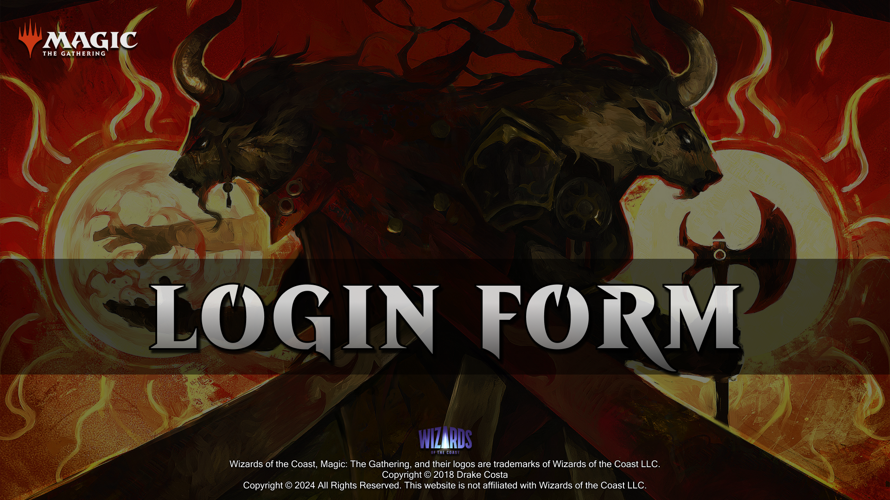

# LOGIN-FORM

## INTRODUCTION

Creating a login form, starting with the HTML structure, and then styling it through CSS files.

## EXECUTION

1. Open the software in your browser by right-clicking on the index.html file and selecting the option "Open with Live Server" or by using Microsoft's "Live Preview" extension for Visual Studio Code.

## LICENSE

All fonts are copyright of [Wizards of the Coast](http://magicthegathering.com).

CSS released under the [MIT license](https://github.com/Saeris/typeface-beleren-bold/blob/master/LICENSE.md).
